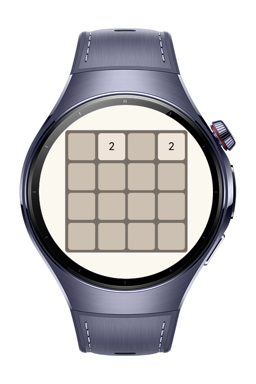
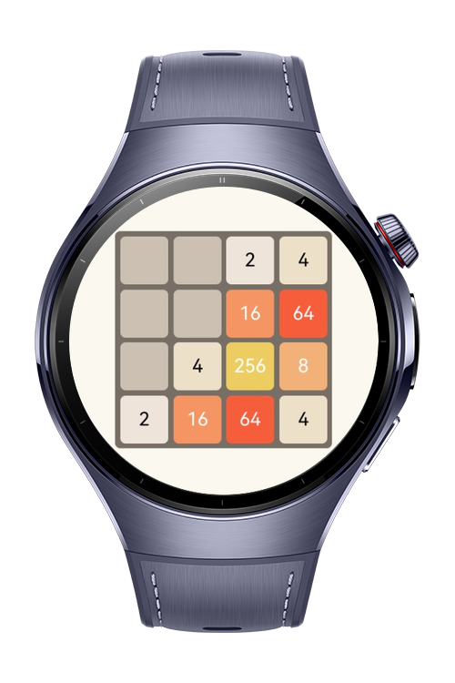
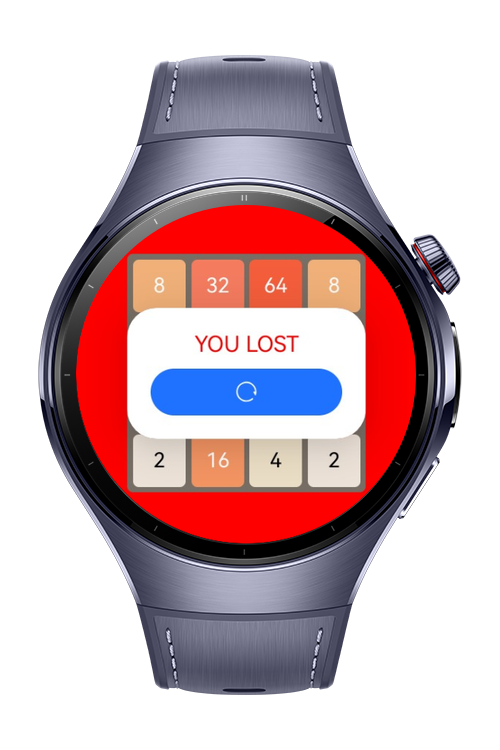
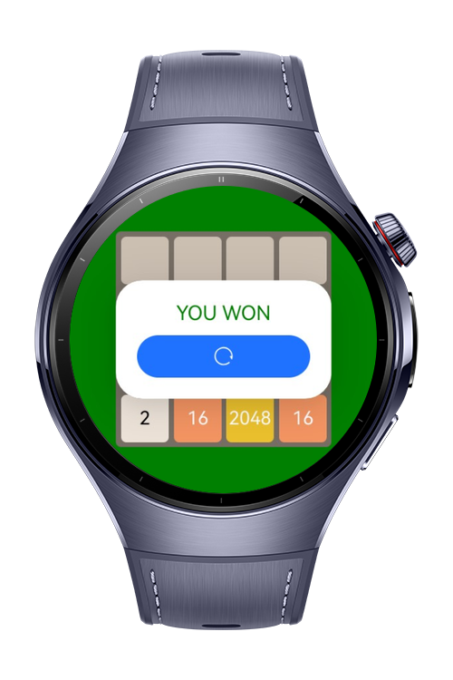

> **Note:** To access all shared projects, get information about environment setup, and view other guides, please visit [Explore-In-HMOS-Wearable Index](https://github.com/Explore-In-HMOS-Wearable/hmos-index).

# Puzzle Game

In the puzzle game, players slide numbered tiles on a 4x4 grid to merge them into higher values. The goal is to reach the
2048 tile. Each move combines matching numbers. The game ends when players reach the 2048 tile or when no more moves are
possible.

# Preview
<div>




</div>

# Use Cases
Play and enjoy the best game ever.

# Tech Stack

- **Languages**: ArkTS, ArkUI
- **Frameworks**: HarmonyOS SDK 5.0.2(14)
- **Tools**: DevEco Studio Vers 5.1.0.820
- **Libraries**: @kit.ArkUI

# Directory Structure

```
entry/src/main/ets/
├───components
│       board_item.ets
│       win_lose_popup.ets
├───entryability
│       EntryAbility.ets
├───entrybackupability
│       EntryBackupAbility.ets
├───model
│       GameNum.ets
│       GameStatus.ets
├───pages
│       Index.ets
└───viewmodel
        game.ets
```

# Constraints and Restrictions
## Supported Device
- Huawei watch 5

# LICENSE
**Puzzle Game** is distributed under the terms of the MIT License.
See the [LICENSE](/LICENSE) for more information.

